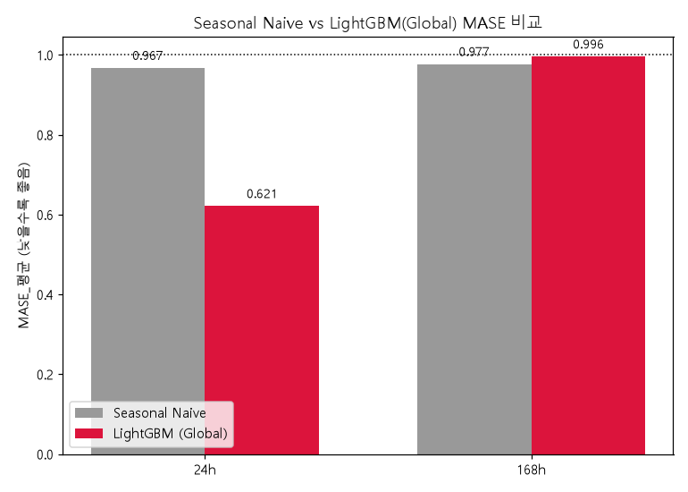
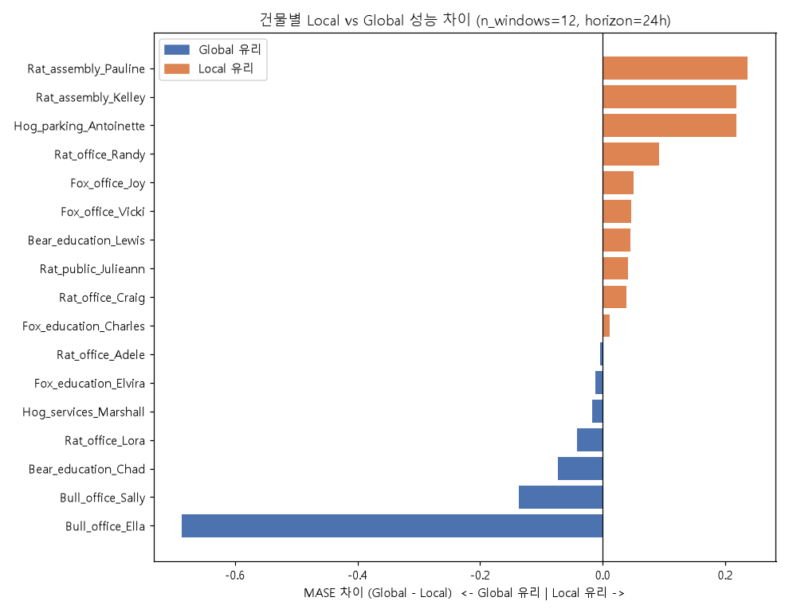
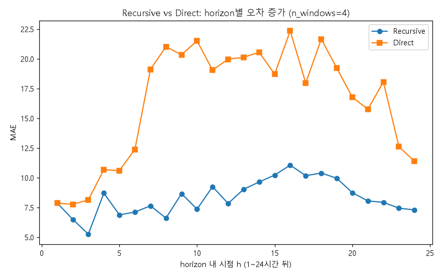
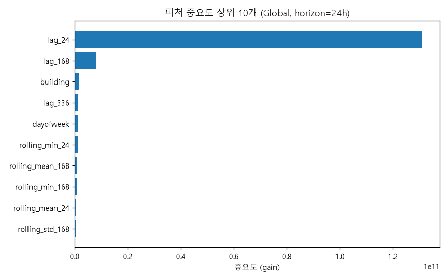
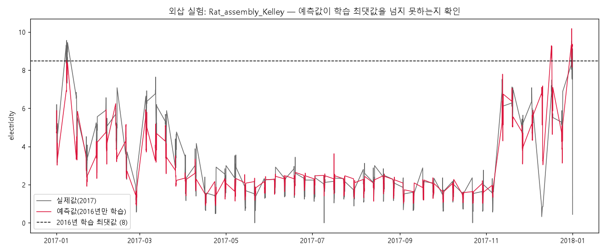

# 주간 보고서 — 3주차

## 1. 기본 정보
- 주차 / 기간: 3주차, 2026-09-11 ~ 2026-09-14
- 작성자: 김동호
- 실습시간: 계획 8h / 실제 18h

## 2. 이번 주 목표
1. `src/backtest.py`의 `rolling_backtest` 인터페이스를 그대로 두고, 3주차 피처 파이프라인(lag·rolling·캘린더·주기 인코딩)을 구현해 `model_fn`/`predict_fn`에 끼워 넣는다.
2. LightGBM global model을 2주차 하네스로 백테스트하고, MASE를 Seasonal Naive 베이스라인(0.9673/0.9767) 대비 몇 % 개선했는지 `results/baseline_seasonal_naive.csv`와 나란히 기록한다.

## 3. 수행 내역

| # | 과제 | 산출물 |
|---|---|---|
| 1 | 피처 파이프라인 | `src/features.py` |
| 2 | Global model 백테스트 | `results/wk3/global_model_summary.csv` |
| 3 | Local vs Global 비교 | `results/wk3/local_vs_global_per_building.csv` |
| 4 | Recursive vs Direct 비교 | `results/wk3/recursive_vs_direct_by_h.csv` |
| 5 | 피처 중요도 top10 | `results/wk3/feature_importance_top10.csv` |
| 6 | 외삽 실험 | `results/wk3/extrapolation_summary.csv` |

## 4. 정량 결과   ★필수

### 4-1. Global model vs Seasonal Naive

| horizon | Naive MASE | LightGBM MASE | 개선율 |
|---|---|---|---|
| 24h | 0.9673 | **0.6211** | **+35.8%** |
| 168h | 0.9767 | 0.9955 | -1.9% (동률) |

### 4-2. Local vs Global (건물별, n_windows=12, horizon=24h)

| 구분 | 건물 수 | 평균 면적 | MASE_평균 |
|---|---|---|---|
| Global 유리 | 7 | 18,163㎡ | 0.567 |
| Local 유리 | 10 | 3,672㎡ | 0.565 |

### 4-3. Recursive vs Direct (n_windows=4, horizon=24h)

| 방식 | MASE_평균 |
|---|---|
| **Recursive** | **0.4852** |
| Direct | 0.8468 |

### 4-4. 피처 중요도 top 5 (horizon=24h)

| 순위 | 피처 | gain |
|---|---|---|
| 1 | `lag_24` | 1.31e11 |
| 2 | `lag_168` | 8.11e9 |
| 3 | `building` | 1.72e9 |
| 4 | `lag_336` | 1.28e9 |
| 5 | `dayofweek` | 1.17e9 |

### 4-5. 외삽 실험

| 항목 | 값 |
|---|---|
| 건물 | `Rat_assembly_Kelley` |
| 2016년 학습 최댓값 | 8.48 |
| 2017년 실제 최댓값 | 9.56 |
| 2017년 예측 최댓값 | **10.18** (학습 범위 초과) |

## 5. 해석

| #  | 발견 | 원인 |
|--- |---  | ---  |
| 4-1 | 24h는 +35.8% 개선, 168h는 동률 | horizon=168에서는 `lag_24`가 필터링되어 사라지고, 남은 최강 피처 `lag_168`이 Naive가 쓰는 정보와 완전히 같아짐 (재검증: 168h 모델의 1위 피처도 `lag_168`) |
| 4-2 | Global 초기 실패 → 용량 문제로 진단·해결 | `num_leaves=31→127`, `n_estimators=100→300`으로 올리자 MASE 1.12→0.62 정상화 |
| 4-2 | 큰 건물(Office·Education)은 Global 유리, 작고 특이한 건물(집회장·주차장)은 Local 유리 | Global의 `building` 분기는 여러 건물이 비슷한 패턴일 때 분기 하나로 묶어 데이터를 공유하지만, 특이 건물은 전용 분기가 필요해 용량을 더 씀 |
| 4-3 | Recursive가 Direct보다 압도적으로 좋음 | h=1은 두 방식이 동일(로직 검증 완료), h≥2부터 Direct 오차 급증 — window 4개로 축소해 24개 서브모델 각각의 학습이 부족했을 가능성 |
| 4-5 | 예측이 학습 범위를 실제값보다도 더 초과 | 단일 트리와 달리 그래디언트 부스팅은 잔차를 누적해서 더하므로 이론상 원래 범위를 넘을 수 있음 |

## 6. 막힌 점   ★필수

| 문제 | 가설 | 검증 방법 | 결과 |
|---|---|---|---|
| Global MASE 1.12/1.46 (Naive보다 나쁨) | 피처 누수보다 모델 용량 부족했음 | Local과 같은 가벼운 설정 vs 용량을 올린 설정을 4주 규모로 비교 | 용량 상향 후 MASE 0.50~0.62로 정상화 |
| Direct가 Recursive보다 훨씬 나쁨 | window 4개로 축소해 h별 서브모델이 충분히 학습 못함 | h=1 결과 일치 여부로 로직 검증 후 h별 오차 분해 | 로직은 정상, 원인은 window 부족으로 추정 |
| 외삽 실험에서 예측이 범위를 더 크게 초과 | "트리는 범위를 못 벗어난다"는 설명이 부정확 | 그래디언트 부스팅 구조 재검토 | 잔차 누적 구조상 넘을 수 있음을 확인, 설명 정정 |

## 7. 다음 주 목표
1. LEAD 1.0 데이터를 다운로드해 구조·이상 비율을 파악하고, `building_id_kaggle` ↔ LEAD `building_id`로 BDG2 서브셋과 조인한다.
2. 예측잔차 기반 이상진단기를 구현한다 —> `n_windows=4`(2016년 한정, 하네스 코드 불변)로 재실행해 잔차를 뽑고 LEAD 라벨과 대조한다.

## 8. 질문
(1) 3-4에서 Direct가 저조했던 것이 window 축소(4개) 때문인지, 24개 서브모델에 하이퍼파라미터를 공유시킨 것 자체가 문제인지 궁금합니다.
(2) Global 모델은 Local보다 훨씬 큰 용량이 필요했는데, 건물 개수에 비례해 용량을 얼마나 늘려야 하는지에 대한 기준이 있는지 궁금합니다.
