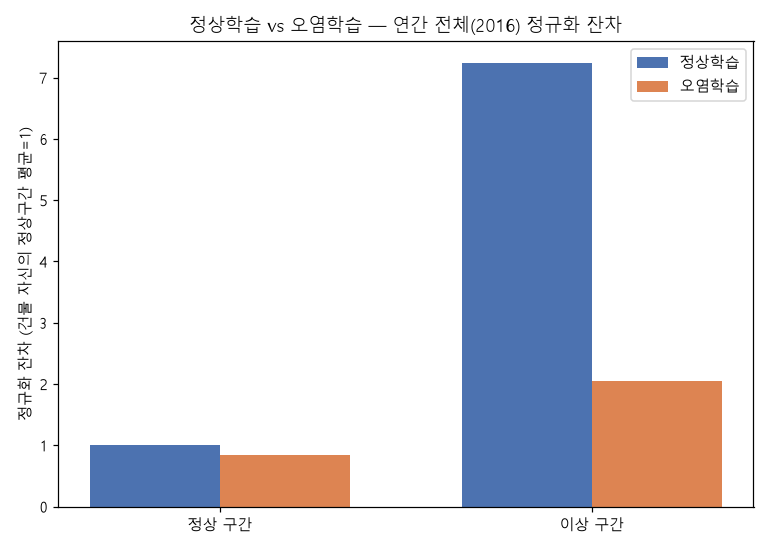
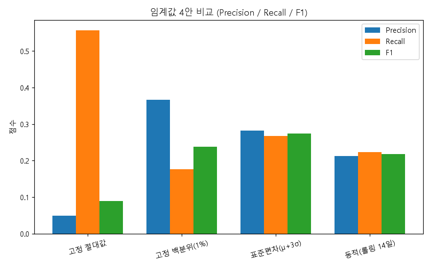
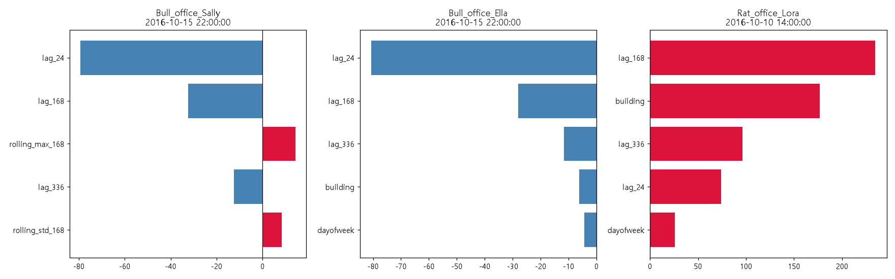

# 주간 보고서 — 4주차

## 1. 기본 정보
- 주차 / 기간: 4주차, 2026-09-19
- 작성자: 김동호
- 실습시간: 계획 8h / 실제 10h

## 2. 이번 주 목표
1. LEAD 1.0 데이터를 다운로드해 구조·이상 비율을 파악하고, `building_id_kaggle` ↔ LEAD `building_id`로 BDG2 서브셋과 조인한다.
2. 예측잔차 기반 이상진단기를 구현한다 — `n_windows=4`(2016년 한정, 하네스 코드 불변)로 재실행해 잔차를 뽑고 LEAD 라벨과 대조한다.

## 3. 수행 내역

| # | 과제 | 산출물 |
|---|---|---|
| 1 | 과제 4-1. LEAD 1.0 데이터 파악 및 BDG2 조인 | `Data/raw/lead/lead1.0-small.csv` |
| 2 | 과제 4-2. 정상 구간만으로 학습 | `results/wk4/residuals_full_year.csv` |
| 3 | 과제 4-3. 잔차 기반 탐지 | `results/wk4/residual_summary_full_year.csv` |
| 4 | 과제 4-4. 임계값 4안 비교 | `results/wk4/threshold_comparison.csv` |
| 5 | SHAP 근거 리포트 3건 | `results/wk4/shap_explanations.csv` |

## 4. 정량 결과   ★필수

### 4-1. 과제 4-1. LEAD 1.0 데이터 파악 및 BDG2 조인

| 항목 | 값 |
|---|---|
| 건물 수 | 200 (전체 이상률 2.13%) |
| 기간 | 2016-01-01 ~ 2016-12-31 |
| 미터 종류 | `meter_reading` 1개 → **electricity 단독 라벨로 확정** |
| BDG2 전체 조인 매칭 | 200 / 200 |
| **우리 17개 서브셋 조인 매칭** | **17 / 17** |
| 우리 17개 이상률 범위 | 0.99% ~ 6.46% (`Rat_office_Randy` 최고) |

### 과제 4-2. 정상 구간만으로 학습, 과제 4-3. 잔차 기반 탐지

| 모델 | 정상구간 정규화잔차 | 이상구간 정규화잔차 |
|---|---|---|
| 정상학습 | 1.00 | **7.23** |
| 오염학습 | 0.85 | 2.04 |

**오염 학습으로 인한 이상구간 탐지력 저하: 71.8%**

### 과제 4-4. 임계값 4안 비교

| 방식 | Precision | Recall | F1 |
|---|---|---|---|
| 고정 절대값 | 0.049 | 0.557 | 0.090 |
| 고정 백분위(1%) | 0.367 | 0.176 | 0.238 |
| **표준편차(μ+3σ)** | 0.283 | 0.267 | **0.275** |
| 동적(롤링 14일) | 0.213 | 0.223 | 0.218 |

### 과제 4-5. SHAP 근거 리포트

| 건물 | 시각 | 실제값 | 예측값 | top1 기여 피처 |
|---|---|---|---|---|
| `Bull_office_Sally` | 2016-10-15 22:00 | 2,383 | 93 | `lag_24` (-79) |
| `Bull_office_Ella` | 2016-10-15 22:00 | 1,842 | 60 | `lag_24` (-81) |
| `Rat_office_Lora` | 2016-10-10 14:00 | 238 | 847 | `lag_168` (+235) |

## 5. 해석

**4-1.**
- 200개의 건물에서 Subset을 고른 이유
 BD2G는 건물이 1636개인데, 이때 LEAD 1.0 이상 라벨은 이 중 200개 건물에만 붙어있어 `lead_labeled_candidates.csv` 안에서만 Subset을 고른 것이다. 즉 이 파일의 200개 건물 밖에서 건물을 골랐으면 라벨과의 매칭이 깨질 수 있다.

결과: 17개의 Subset 모두 Label과 매칭됨

**4-2, 3.**
**처음 백테스트를 진행했을 때 이상구간 잔차가 오히려 정상보다 작게 나왔음**
- 짧은 구간에 이상 시점이 0 ~ 4개인 건물이 많고, `Rat_office_Adele`처럼 이상이 0건인 대형 건물의 정상구간 잔차가 정상구간 평균을 과대하게 끌어올림
- 왜곡이 있다 판단 후 건물별 정규화 실시 하였음 -> 이후 문제 해결
- "3단계에서 가장 중요한 것은 1번입니다. 이상이 섞인 구간까지 학습에 넣으면 모델이 이상을 정상 패턴으로 학습함" => 교재에서 말한 내용과 동일한 결과가 나옴

결과: 오염 모델은 이상값을 "정상 패턴"의 일부로 학습하여 실제 이상 발생에도 예측이 크게 벗어나지 못함

**4-4.**
- 고정 절대값 최악: 재현율은 높아도 정밀도가 0.049
- 표준편차가 1위: 교재가 말한 롤링보다 좋은 결과

**동적(롤링)의 기준값 자체가 최근 14일 이내에 있었던 다른 이상들로 오염으로 판단**
- 이상이 한 번 발생하면 14일간의 mean/std가 부풀어 올라 다음 이상에 대한 민감도가 떨어졌다고 판단
- 하지만 표준편차 방식은 연간 전체 분포를 기준으로 삼아 국소적 오염의 영향을 덜 받았다고 판단

결과: 교재가 말한 결과(롤링이 우수)와 다르게 표준편차로 임계값을 설정했을 때 좋은 결과가 나옴. 즉 라벨 없는 실전 상황이면 현재 결과값으론 표준편차 방식을 기본으로 쓸 예정
(로버스트 통계량을 사용해서 동적(롤링)방법을 강건하게 하는 방안도 모색)

**4-5.**
## SHAP 근거 설명 리포트
표준편차 임계값 방식에서 잔차가 가장 큰 순서로 서로 다른 건물 3건 추출

**1. `Bull_office_Sally`, 2016-10-15 22:00**

모델은 93kWh 정도로 예측했다. `lag_24`(어제 같은 시각)가 -79kWh, `lag_168`는 -32kWh만큼 함. 최근 며칠간의 패턴만 보면 낮은 전력 값이어야 정상이었다. 그런데 실제 소비는 2,383kWh — 예측치의 약 25배였다. 최근 패턴으로는 도무지 설명이 안 되는 급격한 소비 폭증이다.

**2. `Bull_office_Ella`, 2016-10-15 22:00**

1번과 **시각이 정확히 일치**한다. 예측값 60kWh, `lag_24` -81kWh, `lag_168` -28kWh로 기여 패턴도 거의 판박이인데, 실제 소비 역시 1,842kWh로 예측 대비 약 30배 치솟았다. 같은 시각에 같은 `Bull` 사이트 소속 건물 두 곳에서 동시에 이런 일이 벌어졌다는 건 우연으로 보기 어렵다. 개별 건물의 이상이라기보다는 **사이트 전체에 걸린 공동 이벤트(계측 시스템 오류, 혹은 사이트 공용 설비의 이상)일 가능성으로 판단했다.** 

**3. `Rat_office_Lora`, 2016-10-10 14:00**

모델은 847kWh로 높게 예측했다. 하지만 `lag_168`(1주 전 같은 시각)이 +235kWh, `building`(이 건물의 기본 소비 수준) 자체가 +177kWh를 밀어 올렸으니, 평소 패턴을 따랐다면 소비가 높아야 할 시간대였다. 그런데 실제 소비는 238kWh로 예측보다 훨씬 낮았다. **평소 패턴으로는 설명되지 않는 소비 급감이고, 설비 정지나 가동 중단을 의심할 만하다.**

결론: 이렇게 각각의 건물들의 이상 탐지를 진행하면서 기상, 일정으로 판단되지 않은 이상들을 확인 하였다. 실제 라벨이 없는 **현장**에서 어떻게 판단을 해야하는지에 대한 방법론에 대해 이해하게 되었다.

## 6. 막힌 점   ★필수

| 문제 | 가설 | 검증 방법 | 결과 |
|---|---|---|---|
| `n_windows=4` 백테스트에서 이상구간 잔차가 정상구간보다 작게 나옴 | 평가 구간이 좁아 이상 표본이 부족 + 건물별 스케일 혼합 | 건물별 이상 라벨 개수, 정상구간 잔차 크기를 직접 확인 | `Rat_office_Adele`처럼 이상 0건인 대형 건물이 "정상구간 평균"을 과대하게 끌어올린 것으로 확인. 연간 전체 + 건물별 정규화로 재분석해 해결 |

## 7. 다음 주 목표
1. 5주차를 진행하기 전, 이번 주 이상진단 파이프라인을 재사용 가능한 형태로 정리하겠다.
2. 동적(롤링) 임계값이 오염에 강건해지도록 로버스트 통계량 적용을 검토한다.

## 8. 질문
(1) 4-4에서 동적 롤링이 표준편차 방식보다 낮게 나온 것을 "롤링 기준이 최근 이상으로 오염된다"고 해석했는데, 이 해석이 맞는지, 아니면 롤링 창 크기를 잘못 잡은 것인지 여쭤보고 싶습니다.

